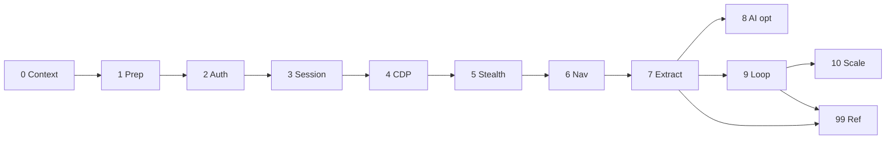

# X (x.com) CDP post listener — master plan

This document is the **entry point**. Detailed work is split into **modular phase files** under [`plans/`](./plans/README.md).

For **build-ready detail** (repository layout, modules per phase, config keys, checklists, sprint order), use **[`plans/development/concrete-work.md`](./plans/development/concrete-work.md)**.

## One-line objective

Poll one or more X profile timelines from a **real, logged-in Chrome** controlled via **CDP + Playwright**, extract tweets with stable selectors, **dedupe by tweet ID**, and append new posts to durable storage (optional webhooks).

## Phase map (execute in order)

| Order | Phase | Link |
|------:|-------|------|
| 0 | Context, strategy, risks | [plans/phase-00-context-and-risks.md](./plans/phase-00-context-and-risks.md) |
| 1 | Preparation (Chrome, Playwright, profile) | [plans/phase-01-preparation.md](./plans/phase-01-preparation.md) |
| 2 | Authentication capture | [plans/phase-02-authentication-capture.md](./plans/phase-02-authentication-capture.md) |
| 3 | Session injection over CDP | [plans/phase-03-session-injection.md](./plans/phase-03-session-injection.md) |
| 4 | CDP connection layer | [plans/phase-04-cdp-connection.md](./plans/phase-04-cdp-connection.md) |
| 5 | Anti-detection | [plans/phase-05-anti-detection.md](./plans/phase-05-anti-detection.md) |
| 6 | Navigation & interaction | [plans/phase-06-navigation-listener.md](./plans/phase-06-navigation-listener.md) |
| 7 | Data extraction & dedupe | [plans/phase-07-data-extraction.md](./plans/phase-07-data-extraction.md) |
| 8 | AI agent integration *(optional)* | [plans/phase-08-ai-agent-integration.md](./plans/phase-08-ai-agent-integration.md) |
| 9 | Loop & scheduling | [plans/phase-09-loop-scheduling.md](./plans/phase-09-loop-scheduling.md) |
| 10 | Multi-instance scaling | [plans/phase-10-multi-instance-scaling.md](./plans/phase-10-multi-instance-scaling.md) |
| — | Reference: flow, skeleton, maintenance | [plans/phase-99-reference-flow-maintenance.md](./plans/phase-99-reference-flow-maintenance.md) |

Full table with short summaries: [plans/README.md](./plans/README.md).

## Dependency sketch

Phase 8 branches off Phase 7 and is optional; Phase 99 is documentation and a consolidated checklist, not a gate.

## Quick start path

1. Read **Phase 0** (risks and ToS).  
2. Implement **Phases 1–7** for a single account and `user-data-dir` login.  
3. Add **Phase 9** for the polling loop.  
4. Add **Phase 10** and **Phase 8** only when you need scale or selector resilience.

## Legacy note

The previous monolithic specification was decomposed into the files above; code blocks were normalized (fixed merged `Bash`/`Python` prefixes) and each phase now includes **acceptance criteria** and **outputs** where applicable.
